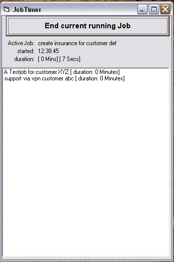



## JobTimer / Taskmanager

### Description

This Application let you manage your Tasks and Jobs. It writes a Logfile with your Jobtimings, Names etc.

Easy to use Taskmanager for Quick Notes about Jobs and Duration of them.
 
### More Info
 
Returns a Logfile which consists of Job Entries with name, start, stop time and duration

             |
---                |---
**Submitted On**   |2005-06-29 06:50:02
**By**             |[Jan\-Martin Ziem](https://github.com/Planet-Source-Code/PSCIndex/blob/master/ByAuthor/jan-martin-ziem.md)
**Level**          |Beginner
**User Rating**    |4.0 (8 globes from 2 users)
**Compatibility**  |VB 6\.0
**Category**       |[Complete Applications](https://github.com/Planet-Source-Code/PSCIndex/blob/master/ByCategory/complete-applications__1-27.md)
**World**          |[Visual Basic](https://github.com/Planet-Source-Code/PSCIndex/blob/master/ByWorld/visual-basic.md)
**Archive File**   |[JobTimer\_\_1906826292005\.zip](https://github.com/Planet-Source-Code/jan-martin-ziem-jobtimer-taskmanager__1-61392/archive/master.zip)

